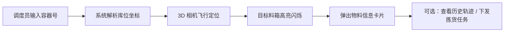
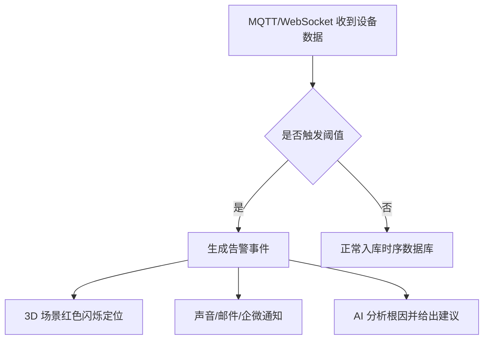
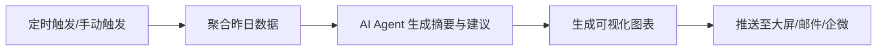

# 产品需求文档：智慧立库 3D SCADA 数字孪生平台（Advanced Edition）

## 1. 产品概述

基于 React + Three.js 构建的新一代自动化立体仓库（AS/RS）数字孪生运维平台，对标并超越传统“3D SCADA 立库数字孪生系统”。平台通过高保真三维场景、实时数据驱动、AI 智能分析与预测性维护，实现仓库运营态势的一屏感知、设备异常的一键定位、任务调度的一键回溯。

- **解决痛点**：传统 WMS/SCADA 系统以二维表格为主，无法直观映射物理空间；异常定位慢、多楼层切换割裂、缺乏预测性维护能力。
- **目标用户**：仓储运营经理、设备运维工程师、调度员、企业管理层。
- **核心价值**：将仓库实时状态、历史轨迹、AI 预测与 3D 空间深度融合，提升故障响应速度 50% 以上，降低非计划停机时间。

## 2. 核心特性

### 2.1 角色体系

| 角色 | 登录/注册方式 | 核心权限 |
|------|---------------|----------|
| 运营经理 | 企业账号/SSO | 查看全局 KPI、生成 AI 日报、导出报表 |
| 运维工程师 | 企业账号/SSO | 接收告警、下钻设备、查看预测性维护建议 |
| 调度员 | 企业账号/SSO | 下发任务、查看 AGV 实时路径、回放历史轨迹 |
| 访客/演示账号 | 只读演示账号 | 仅浏览演示场景，不可操作 |

### 2.2 功能模块

1. **数字孪生大屏**：全局 3D 仓库视图、左右侧数据面板、底部楼层切换、顶部工具栏。
2. **楼层/区域下钻**：整体 / 楼层 / 库位三级缩放，货架、AGV、输送线、提升机逐层显现。
3. **实时 AGV 监控**：编号、电量、状态、坐标、速度、当前任务、工作时长、在线状态。
4. **SCADA 设备监控**：PLC、堆垛机、输送线、提升机、充电桩、摄像头、机械臂状态。
5. **智能告警中心**：低电量、离线、PLC 异常、仓位异常、网络异常，支持声光/邮件/企微通知。
6. **料箱/物料追溯**：输入容器号或物料编码，3D 场景自动飞行定位并高亮，显示物料批次、库位号、出入库时间。
7. **任务调度可视化**：当前任务列表、任务路径动画、历史任务回放。
8. **AI 智能问答**：自然语言查询设备状态、AGV 停机原因、库位利用率等。
9. **AI 预测性维护**：基于电量衰减、振动、温度趋势预测故障并生成维护建议。
10. **AI 日报/周报**：自动生成运营日报，含吞吐量、设备利用率、异常统计。
11. **数据大屏主题**：浅色/深色/赛博朋克三种主题、HUD 显隐切换、全屏演示模式。
12. **多仓协同（预留）**：支持后续切换不同仓库/园区数字孪生场景。

### 2.3 页面详情

| 页面 | 模块 | 功能描述 |
|------|------|----------|
| 登录页 | 账号登录 | 企业账号/SSO 登录、JWT Token、角色鉴权 |
| 数字孪生大屏 | 顶部状态栏 | 系统标题、实时日期时间、全局告警滚动、主题切换 |
| 数字孪生大屏 | 左侧面板 | 机器人状态仪表盘、库位状态环形图、机器人电量分布柱状图、任务统计 |
| 数字孪生大屏 | 中间 3D 场景 | Three.js 多层仓库、AGV 动画、货架、输送线、提升机、摄像头、实时数据绑定 |
| 数字孪生大屏 | 右侧面板 | 充电桩状态、机器人详情列表、实时告警流、AI 建议 |
| 数字孪生大屏 | 底部工具栏 | 整体/楼层切换、视角复位、路径追踪、播放/暂停实时动画 |
| 设备详情页 | 设备卡片 | 设备基础信息、实时状态曲线、历史告警、关联 3D 定位 |
| 任务调度页 | 任务列表 | 任务状态、优先级、路径预览、历史回放 |
| AI 问答页 | 对话窗口 | 多轮对话、知识库引用、智能推荐问题 |
| 报表中心 | 日报/周报 | AI 自动生成、图表可视化、导出 PDF/Excel |
| 系统管理 | 用户/角色/菜单 | RBAC、操作日志、参数配置 |

## 3. 核心流程

### 3.1 料箱追溯流程

### 3.2 实时告警处理流程

### 3.3 AI 日报生成流程

## 4. 用户界面设计

### 4.1 设计风格

- **主色调**：深空蓝 `#050d24` 作为背景，营造指挥控制中心氛围；强调色使用电光青 `#00d2ff` 与极光绿 `#00e676` 表示正常/工作中；告警使用脉冲红 `#ff3b30` 与琥珀 `#ffca28`。
- **面板**：玻璃拟态（`backdrop-filter: blur(16px)`），顶部 2px 电光青渐变边线，圆角 12px，内阴影增强层级。
- **字体**：标题使用科技感无衬线字体（推荐 `Orbitron` / `Rajdhani`），正文使用 `Noto Sans SC` 保证中文可读性。
- **布局**：经典的“左-中-右”三块式 SCADA 大屏，中间 3D 场景占 60% 宽度；左侧 20% 放运营指标，右侧 20% 放设备与告警。
- **图标**：线性图标 + 霓虹发光效果，顶部工具栏使用圆角胶囊按钮。

### 4.2 页面设计概述

| 页面 | 模块 | UI 元素 |
|------|------|---------|
| 数字孪生大屏 | 顶部状态栏 | 左侧日期星期、中间系统标题带发光字、右侧实时时间；告警跑马灯；主题切换按钮组 |
| 数字孪生大屏 | 左侧面板 | 六个机器人状态玻璃仪表盘、库位状态大环形图、电量分布柱状图、任务完成率卡片 |
| 数字孪生大屏 | 中间 3D 场景 | 多层 AS/RS 仓库、AGV 实时移动、货架发光状态、提升机垂直运动、底部楼层切换胶囊按钮 |
| 数字孪生大屏 | 右侧面板 | 充电桩环形图、机器人详情滚动表格、实时告警卡片流、AI 维护建议气泡 |
| 数字孪生大屏 | 底部工具栏 | 播放/暂停、整体/楼层切换、视角复位、料箱搜索、历史回放 |

### 4.3 响应式策略

- **桌面优先**：设计基准为 1920×1080 指挥大屏。
- **自适应**：宽度低于 1600px 时，左右侧面板宽度缩至 320px；低于 1280px 时，面板可折叠为抽屉。
- **触控优化**：顶部与底部按钮尺寸 ≥ 44px，支持手势缩放 3D 场景。

### 4.4 3D 场景指导

- **环境与氛围**：深色太空背景，带微弱星尘粒子与网格地面，反射地板增强科技感。
- **灯光**：主方向光（冷白 #e0f7ff）+ 补光（蓝色 #4facfe）+ 货架边缘自发光条（按状态变色）。
- **相机**：默认 45° 俯视慢速环绕；楼层切换与料箱定位时使用 Tween 平滑飞行。
- **构图**：仓库位于画面中心，货架阵列呈透视延伸，AGV 与输送线作为动态焦点。
- **交互**：鼠标左键旋转、右键平移、滚轮缩放；点击设备弹出信息卡片；悬浮显示工具提示。
- **动画**：AGV 沿路径平滑移动并带转向倾斜；提升机垂直升降；料箱搜索时目标绿色脉冲高亮。
- **后处理**：Bloom（辉光）、SSAO（环境光遮蔽）、Tone Mapping，控制性能预算在 60fps。
- **资产来源**：仓库/货架/AGV/充电桩使用程序化生成或自建模 GLB；优先使用轻量低模，确保首屏加载 < 3s。
