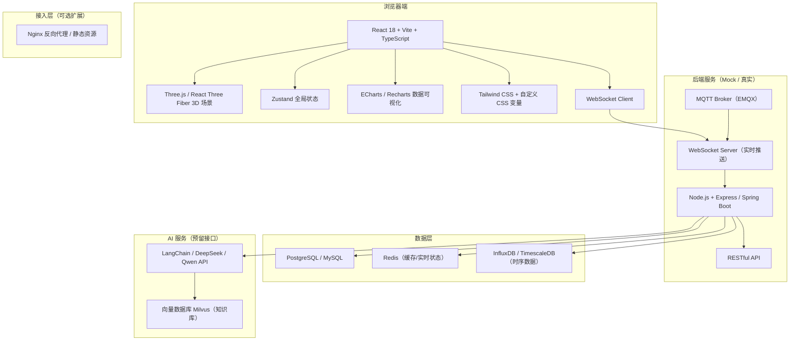
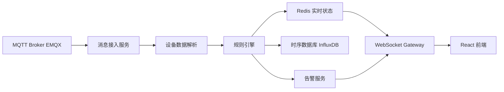
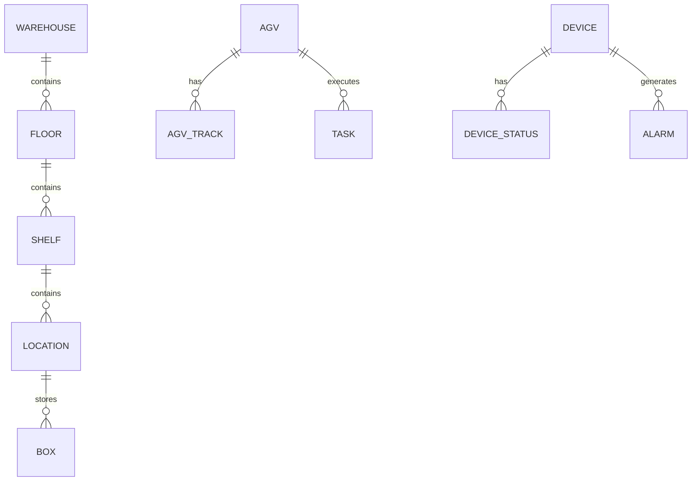

# 技术架构文档：智慧立库 3D SCADA 数字孪生平台

## 1. 架构设计



## 2. 技术选型

- **前端框架**：React 18 + TypeScript + Vite
- **3D 引擎**：Three.js + @react-three/fiber + @react-three/drei + @react-three/postprocessing
- **状态管理**：Zustand（轻量、无样板代码）
- **路由**：React Router v6
- **UI 样式**：Tailwind CSS + CSS Variables（支持主题切换）
- **图表**：ECharts for React（复杂图表）+ Recharts（轻量图表）
- **动画**：GSAP（相机飞行、面板动画）+ Framer Motion（React 组件动画）
- **实时通信**：原生 WebSocket（浏览器端）+ 模拟服务端（开发阶段）
- **后端（第一阶段使用 Mock）**：
  - 开发期使用 `vite-plugin-mock` 或独立 Node 脚本模拟 WebSocket 与 REST API。
  - 生产期可替换为 Spring Boot / Express + MQTT。
- **数据库（预留）**：PostgreSQL（业务数据）+ Redis（实时状态缓存）+ InfluxDB（时序数据）
- **AI（预留接口）**：DeepSeek / Qwen API + LangChain 代理

## 3. 路由定义

| 路由 | 用途 |
|------|------|
| `/login` | 登录页 |
| `/` | 数字孪生大屏（默认首页） |
| `/dashboard` | 数字孪生大屏（别名） |
| `/devices` | 设备详情与 SCADA 监控 |
| `/tasks` | 任务调度与历史回放 |
| `/ai-chat` | AI 智能问答 |
| `/reports` | 报表中心（AI 日报/周报） |
| `/system/users` | 用户管理 |
| `/system/roles` | 角色管理 |
| `/system/logs` | 操作日志 |

## 4. API 定义（Mock 阶段）

### 4.1 REST API

```typescript
// 获取仓库概览数据
GET /api/warehouse/overview
Response: {
  robotStatus: { total: number; working: number; charging: number; idle: number; offline: number; abnormal: number };
  locationStatus: { total: number; free: number; occupied: number; abnormal: number; locked: number };
  powerDistribution: number[]; // 5 个区间
  taskStats: { pending: number; running: number; completed: number; failed: number };
}

// 获取 AGV 列表
GET /api/agv/list
Response: AgvItem[]

interface AgvItem {
  id: string;
  name: string;
  status: 'working' | 'charging' | 'idle' | 'offline' | 'abnormal';
  battery: number;
  position: { x: number; y: number; z: number; floor: number };
  speed: number;
  taskId?: string;
  workTime: number;
  online: boolean;
}

// 获取料箱信息
GET /api/box/:containerCode
Response: {
  containerCode: string;
  materialCode: string;
  batchNo: string;
  locationCode: string;
  position: { x: number; y: number; z: number; floor: number };
  inboundTime: string;
}

// 获取实时告警
GET /api/alarms
Response: AlarmItem[]

interface AlarmItem {
  id: string;
  level: 'critical' | 'warning' | 'info';
  type: string;
  message: string;
  deviceId: string;
  timestamp: string;
  acknowledged: boolean;
}
```

### 4.2 WebSocket 消息

```typescript
// 服务端 -> 客户端
interface WsMessage {
  type: 'agv.update' | 'device.update' | 'alarm' | 'location.update' | 'task.update';
  payload: any;
  timestamp: number;
}

// 客户端 -> 服务端
interface WsCommand {
  type: 'subscribe.floor' | 'unsubscribe.floor' | 'query.box' | 'control.camera';
  payload: any;
}
```

## 5. 服务端架构（生产期扩展）



## 6. 数据模型

### 6.1 实体关系图



### 6.2 核心表结构（PostgreSQL 风格）

```sql
-- 仓库
CREATE TABLE warehouse (
  id SERIAL PRIMARY KEY,
  code VARCHAR(64) UNIQUE NOT NULL,
  name VARCHAR(128) NOT NULL,
  floors INTEGER NOT NULL,
  length DECIMAL(10,2),
  width DECIMAL(10,2),
  height DECIMAL(10,2)
);

-- 楼层
CREATE TABLE floor (
  id SERIAL PRIMARY KEY,
  warehouse_id INTEGER REFERENCES warehouse(id),
  floor_no INTEGER NOT NULL,
  height DECIMAL(10,2)
);

-- 货架
CREATE TABLE shelf (
  id SERIAL PRIMARY KEY,
  floor_id INTEGER REFERENCES floor(id),
  code VARCHAR(64) UNIQUE NOT NULL,
  position_x DECIMAL(10,2),
  position_z DECIMAL(10,2),
  rows INTEGER,
  cols INTEGER
);

-- 库位
CREATE TABLE location (
  id SERIAL PRIMARY KEY,
  shelf_id INTEGER REFERENCES shelf(id),
  code VARCHAR(64) UNIQUE NOT NULL,
  row_no INTEGER,
  col_no INTEGER,
  status VARCHAR(16) CHECK (status IN ('free','occupied','locked','abnormal'))
);

-- AGV
CREATE TABLE agv (
  id SERIAL PRIMARY KEY,
  code VARCHAR(64) UNIQUE NOT NULL,
  name VARCHAR(128),
  battery DECIMAL(5,2),
  status VARCHAR(16),
  position_x DECIMAL(10,2),
  position_y DECIMAL(10,2),
  position_z DECIMAL(10,2),
  speed DECIMAL(5,2),
  online BOOLEAN DEFAULT true
);

-- 料箱
CREATE TABLE box (
  id SERIAL PRIMARY KEY,
  container_code VARCHAR(64) UNIQUE NOT NULL,
  material_code VARCHAR(64),
  batch_no VARCHAR(64),
  location_id INTEGER REFERENCES location(id),
  inbound_time TIMESTAMP
);

-- 告警
CREATE TABLE alarm (
  id SERIAL PRIMARY KEY,
  level VARCHAR(16),
  type VARCHAR(64),
  message TEXT,
  device_id VARCHAR(64),
  device_type VARCHAR(32),
  timestamp TIMESTAMP DEFAULT CURRENT_TIMESTAMP,
  acknowledged BOOLEAN DEFAULT false
);
```

## 7. 关键技术决策

1. **3D 场景优先使用 @react-three/fiber**：声明式 API 更适合 React 生态，便于状态驱动 3D。
2. **AGV 路径动画使用 GSAP / @react-spring/three**：保证平滑插值与性能。
3. **楼层切换通过 visibility/clip 控制**：避免重新加载场景，保持数据一致性。
4. **实时数据使用 WebSocket + Zustand**：集中管理，所有面板订阅同一状态源。
5. **主题切换使用 CSS Variables + Tailwind**：切换成本低，支持深色/浅色/赛博朋克。
6. **Mock 数据先行**：先实现完整前端交互与 3D 效果，再接入真实后端。
